# Gastric Cancer EMT–TME

[](LICENSE)
[](https://www.r-project.org/)
[](https://www.ncbi.nlm.nih.gov/geo/query/acc.cgi?acc=GSE183904)

Single-cell analysis of epithelial–mesenchymal transition (EMT) and tumor-microenvironment (TME)
signaling in gastric cancer. The pipeline processes the GSE183904 atlas, resolves epithelial EMT
states, infers an EMT trajectory, identifies T/NK-derived ligands predicted to act on low-EMT
epithelium, prioritizes EMT-associated lncRNAs, and tests those candidates against overall
survival in TCGA-STAD.

Source dataset: **GSE183904** — a single-cell atlas of gastric cancer spanning clinical stages
I–IV (Kumar *et al.*, *Cancer Discovery*, 2022). This repository is a focused reanalysis, not a
reproduction of that atlas.

## Release status

This repository contains the **analysis code only**. Figures, result tables, and candidate gene
lists are withheld pending publication of the associated manuscript, and will be added here on
acceptance. The code is complete and runnable: anyone with access to GSE183904 and TCGA-STAD can
execute the full pipeline and regenerate every output described below.

---

## Scope

The pipeline addresses seven questions:

1. Which epithelial and TME populations are present in GSE183904
2. How EMT programs are distributed across epithelial cells
3. Whether epithelial cells form a continuous EMT trajectory
4. Which T/NK-cell ligands are predicted to drive EMT-associated transcriptional programs
5. Which transcription factors correlate with lncRNA expression in epithelial cells
6. Which lncRNAs are associated with high-EMT epithelial states
7. Whether those lncRNAs associate with overall survival in TCGA-STAD

---

## Workflow

```mermaid
graph LR
  subgraph P["Preprocessing"]
    A["GSE183904<br/>raw counts"] --> B["QC filtering"]
    B --> C["Per-sample<br/>DoubletFinder"]
    C --> D["Normalize + PCA"]
    D --> E["Harmony<br/>integration"]
    E --> F["UMAP +<br/>clustering"]
  end

  subgraph S["EMT state analysis"]
    F --> G["Cell-type<br/>annotation"]
    G --> H["Epithelial<br/>subset"]
    H --> I["EMT C-score<br/>+ 5-state GMM"]
    I --> J["Monocle3<br/>trajectory"]
    J --> K["Trajectory gene<br/>modules"]
  end

  subgraph V["Signaling and validation"]
    K --> L["NicheNet<br/>T/NK to EMT-low"]
    L --> M["TF-lncRNA<br/>correlation"]
    M --> N["EMT-associated<br/>lncRNA candidates"]
    N --> O["TCGA-STAD<br/>Cox survival"]
  end
```



---

## Repository structure

```
gastric-cancer-emt-tme/
├── R/
│   ├── 01_download_qc_integration.R    # download, QC, doublets, Harmony
│   ├── 02_add_sample_metadata.R        # clinical and subtype annotation
│   ├── 03_cell_type_annotation.R       # major population labels
│   ├── 04_emt_scoring.R                # EMT C-score and state assignment
│   ├── 05_emt_trajectory_monocle3.R    # pseudotime and gene modules
│   ├── 06_nichenet_ligand_analysis.R   # T/NK to epithelial ligand ranking
│   ├── 07_emt_lncrna_analysis.R        # TF-lncRNA and EMT-DE integration
│   ├── 08_tcga_stad_survival.R         # TCGA-STAD Cox regression
│   └── 09_generate_results_summary.R   # summary tables and report
├── data/
│   ├── README.md                       # data provenance
│   └── metadata/Supp.csv               # GSE183904 sample annotations
├── CITATION.cff
├── LICENSE
└── README.md
```

Two directories are created at runtime and excluded from version control: `results/`
(figures, tables, summary) and `objects/` (intermediate `.rds` files). Raw sequencing data,
reference databases, and TCGA downloads are also excluded. See [`data/README.md`](data/README.md)
and `.gitignore`.

---

## Requirements

R 4.3.3. Core packages: Seurat (v4), harmony, DoubletFinder, monocle3, nichenetr, DESeq2,
TCGAbiolinks, survival, mclust, rtracklayer, dplyr, ggplot2.

Steps 01 and 06 dominate memory and runtime — per-sample DoubletFinder across all GSE183904
samples, and the NicheNet ligand-activity computation. A machine with at least 64 GB RAM is
recommended, along with roughly 150 GB of free disk for the GEO archive, GENCODE annotation,
NicheNet prior models, TCGA-STAD downloads, and intermediate objects.

---

## Running the analysis

```bash
git clone https://github.com/amirmaharati/gastric-cancer-emt-tme.git
cd gastric-cancer-emt-tme
```

From an R session at the repository root:

```r
source("R/01_download_qc_integration.R")
source("R/02_add_sample_metadata.R")
source("R/03_cell_type_annotation.R")
source("R/04_emt_scoring.R")
source("R/05_emt_trajectory_monocle3.R")
source("R/06_nichenet_ligand_analysis.R")
source("R/07_emt_lncrna_analysis.R")
source("R/08_tcga_stad_survival.R")
source("R/09_generate_results_summary.R")
```

The scripts are stateful and numbered: each reads the object written by the previous step, so
they must run in order. To resume mid-pipeline, source a single script directly.

GSE183904, the NicheNet prior models, the GENCODE annotation, and TCGA-STAD data are downloaded
automatically on first use and cached under `data/`.

---

## Pipeline

### 01 — Preprocessing and integration

Downloads GSE183904, builds a combined Seurat object, computes mitochondrial, ribosomal, and
hemoglobin QC metrics, filters cells, and runs DoubletFinder independently per biological sample.
Singlets are merged, normalized, reduced to 2,000 variable features, and projected by PCA;
principal components are retained up to ≥90% cumulative variance. Harmony corrects sample-level
batch effects, followed by UMAP and graph-based clustering at `resolution = 1.0`.

| Filter | Threshold |
|---|---|
| Detected genes (`nFeature_RNA`) | > 300 |
| Total UMI (`nCount_RNA`) | 1,000 – 50,000 |
| Mitochondrial content | < 30% |
| Ribosomal content | < 45% |
| Hemoglobin content | < 1% |

DoubletFinder uses a fixed expected doublet rate declared at the top of the script. The
per-channel loading rate for the original experiment is not reported in GEO, so this is a
documented assumption rather than an experiment-matched value.

### 02 — Sample metadata

Attaches patient ID, tissue status (normal / tumor / metastasis), stage, Lauren subtype, MMR
status, EBV status, and TCGA molecular subtype from `data/metadata/Supp.csv`.

### 03 — Cell-type annotation

Clusters are labelled manually from canonical markers into epithelial cells, T/NK cells, B cells,
plasma cells, macrophages, dendritic cells, mast cells, cancer-associated fibroblasts,
endothelial cells, and pericytes. Clusters without a confident marker-based assignment are kept
and labelled explicitly rather than dropped.

### 04 — EMT scoring

Epithelial cells are subset and reprocessed independently — normalization, variable feature
selection, scaling, and PCA are repeated — then clustered at `resolution = 2.0` to resolve
epithelial heterogeneity.

Module scores are computed for an epithelial and a mesenchymal gene program and cross-checked
against average normalized expression. A composite **C-score** (mesenchymal − epithelial) is
z-scaled, and a five-component Gaussian mixture model assigns each cell to a rank, collapsed into
three states:

| State | GMM components |
|---|---|
| EMT-low | rank 1 + rank 2 |
| EMT-intermediate | rank 3 |
| EMT-high | rank 4 + rank 5 |

### 05 — EMT trajectory

Epithelial cells are re-embedded in Monocle3 using 50 principal components. A principal graph is
learned and pseudotime assigned with root nodes placed programmatically in the EMT-low cluster.
Pseudotime-associated genes are selected at `q < 0.05` and Moran's I > 0.1, then grouped into
co-expression modules at `resolution = 0.001`.

### 06 — T/NK to epithelial signaling

Receiver-focused NicheNet analysis with EMT-low epithelial cells as the receiver population.
Genes detected in at least 10% of EMT-low cells define the expressed background. A ligand is
considered if its cognate receptor is expressed in the receiver population and it exists in the
NicheNet ligand–target matrix. The gene set of interest is the set of trajectory-derived genes
upregulated along pseudotime and present in that matrix; all remaining receiver-expressed genes
form the background. Ligands are ranked by corrected area under the precision–recall curve, and
regulatory-potential scores are extracted for the top ligand–target pairs to identify
transcription factors that may mediate ligand-induced EMT programs.

### 07 — EMT-associated lncRNAs

GENCODE release 49 lncRNA annotations are imported and intersected with the epithelial expression
matrix. Spearman correlations are computed for TF–lncRNA pairs on rank-transformed, scaled
expression. Differential expression between EMT-high and EMT-low epithelial cells uses Seurat's
Wilcoxon rank-sum test. lncRNAs that are both differentially expressed and members of a
correlation-defined module are retained as high-confidence candidates.

| Criterion | Threshold |
|---|---|
| TF–lncRNA correlation (primary) | \|rho\| ≥ 0.5, nominal *p* < 0.05 |
| TF–lncRNA correlation (sensitivity) | \|rho\| ≥ 0.5, BH-adjusted *p* < 0.05 |
| EMT differential expression | adjusted *p* < 0.05, \|log2FC\| > 0.25 |

Both the primary and BH-adjusted correlation sets are written to `results/tables/`, so the effect
of multiple-testing correction on candidate selection is explicit rather than hidden by the
choice of threshold.

### 08 — TCGA-STAD validation

Primary-tumor STAR counts are variance-stabilized with DESeq2. Candidate lncRNA expression is
z-standardized and tested against overall survival by univariate Cox proportional-hazards
regression with Benjamini–Hochberg correction. Hazard ratios are reported per one standard
deviation increase in transformed expression.

Any multigene risk score produced here is exploratory: model fitting and evaluation occur in the
same cohort, with no independent validation set.

### 09 — Results summary

Reads the standardized outputs of steps 01–08 and writes summary tables plus
`results/summary/analysis_summary.md`.

---

## Interpretation and limitations

EMT states here are computationally inferred transcriptional phenotypes, not observed cell-state
transitions, and Monocle pseudotime orders cells by expression similarity rather than by real
time or lineage. NicheNet ranks ligand–target relationships using expression together with prior
knowledge and does not establish causal signaling; TF–lncRNA relationships are correlational.
Candidate lncRNAs should therefore be described as EMT-associated, not as EMT-inducing
regulators, pending experimental validation. Survival results derive from a single cohort and
require replication.

Random seeds are fixed throughout, and each stage writes `sessionInfo()` to `results/`.

---

## Citation

If you use this code, please cite this repository:

```bibtex
@software{maharati_gastric_emt_tme,
  author  = {Maharati, Amir},
  title   = {Gastric Cancer EMT--TME: single-cell EMT and TME signaling analysis},
  year    = {2026},
  version = {1.0.0},
  url     = {https://github.com/amirmaharati/gastric-cancer-emt-tme}
}
```

Machine-readable metadata is in [`CITATION.cff`](CITATION.cff).

Please also cite Kumar *et al.* (*Cancer Discovery*, 2022) for GSE183904, and the primary
publications for Seurat, Harmony, DoubletFinder, Monocle3, NicheNet, GENCODE, DESeq2, and
TCGAbiolinks.

---

## License

MIT — see [`LICENSE`](LICENSE). This license covers the analysis code only. It does not override
the terms of GSE183904, TCGA, GENCODE, NicheNet, or any third-party software used by the
pipeline.
